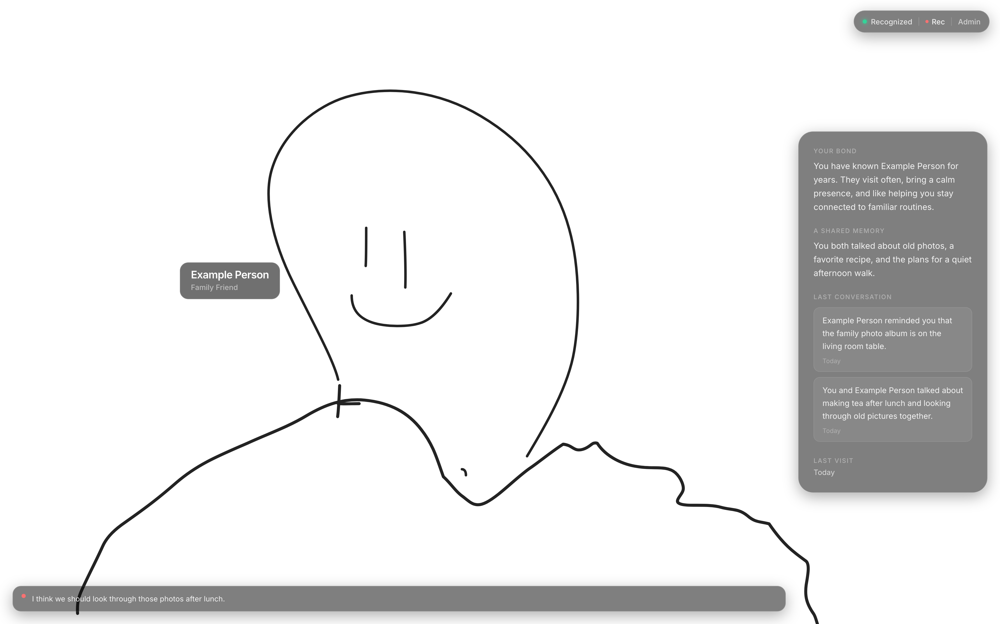

# FamiliarFaces

<p align="center">
  <a href="https://youtu.be/dEbYshVMDz0"><strong>Watch the Demo Video</strong></a>
</p>

<p align="center">
  
</p>

FamiliarFaces is a browser-based companion app for dementia support build for a hackathon. 
It uses a live camera feed to recognize enrolled visitors and shows simple context about
who they are, their relationship to the patient, and recent conversation notes.

> Prototype note: FamiliarFaces handles sensitive biometric and conversation data, so do not use it with real patient or caregiver data without authentication, encryption, and consent controls.

The app is built as a local-first Next.js prototype. Face recognition runs in
the browser with bundled model files, profile data is stored in SQLite through
Prisma, and conversation summaries can be generated locally with Ollama. Speech
transcription depends on the browser's `SpeechRecognition` implementation.

## Features

- Patient view with live camera recognition
- Caregiver admin page for adding people and capturing face samples
- Relationship, bio, and memory prompts for each enrolled person
- Browser speech recognition for conversation transcripts
- Recent conversation summaries shown when a visitor is recognized
- Optional local summarization with Ollama
- Local SQLite persistence for people, face embeddings, and conversations

## How It Works

1. A caregiver opens `/admin` and creates a profile for a visitor.
2. The caregiver captures several face samples from the browser camera.
3. The patient opens `/`.
4. The app compares the live camera frame against stored face embeddings.
5. When a match is found, the patient view displays the visitor's context.
6. If conversation mode is used, the transcript is saved and summarized for
   future visits.

## Tech Stack

- **Framework:** Next.js 15 App Router
- **Language:** TypeScript
- **UI:** React 19 and Tailwind CSS
- **Database:** SQLite
- **ORM:** Prisma
- **Face recognition:** face-api.js
- **Speech:** Browser `SpeechRecognition` / `webkitSpeechRecognition`
- **Optional summaries:** Ollama running locally at `http://localhost:11434`

## Getting Started

### Prerequisites

- Node.js 20 or newer
- npm
- A browser with camera support
- Chrome or Edge for speech recognition
- Optional: Ollama for local conversation summaries

### Setup

Install dependencies:

```bash
npm install
```

Create the local environment file:

```bash
cp .env.example .env
```

Generate the Prisma client and create the SQLite database:

```bash
npm run db:generate
npm run db:push
```

This creates a local `prisma/familiarfaces.db` file, which is ignored by Git.

Start the development server:

```bash
npm run dev
```

Open [http://localhost:3000](http://localhost:3000).

## Optional Local Summaries

Conversation summaries use Ollama when it is available. The app falls back to a
trimmed transcript if Ollama is not running.

```bash
ollama pull llama3.2
ollama serve
```

The summaries endpoint calls:

```text
http://localhost:11434/api/generate
```

## Production Build

Build and run the production app:

```bash
npm run build
npm run start
```

For deployment, set `DATABASE_URL` to a writable SQLite database location or
move the Prisma datasource to a hosted database. Camera access generally
requires HTTPS outside of `localhost`, and speech recognition support depends on
the user's browser.

Before using the app beyond a local demo, add authentication, role-based access
control, encryption at rest, and consent/data deletion workflows.

## Project Structure

```text
docs/
  assets/                     README screenshots and media

prisma/
  schema.prisma              Prisma models

public/
  models/                    face-api.js model files

src/
  app/
    page.tsx                 Patient recognition view
    admin/page.tsx           Caregiver enrollment view
    api/
      conversations/route.ts Conversation history and summaries
      embeddings/route.ts    Face embedding API
      persons/route.ts       Person create/list API
      persons/[id]/route.ts  Person update/delete API
  lib/
    camera.ts                Camera constraints and error messages
    faceRecognition.ts       Model loading, embedding capture, matching
    personPayload.ts         Person payload validation
    prisma.ts                Prisma client singleton
    useSpeechTranscript.ts   Speech recognition hook
```

## Data Model

```text
Person
  id
  name
  relationship
  bio
  recentTopics
  lastSeen

FaceEmbedding
  id
  personId
  embedding

Conversation
  id
  personId
  transcript
  summary
```

## Scripts

```bash
npm run dev          Start the development server
npm run build        Build the production app
npm run start        Run the production build
npm run db:generate  Generate the Prisma client
npm run db:push      Apply the Prisma schema to SQLite
npm run db:studio    Open Prisma Studio
```

## Privacy and Limitations

FamiliarFaces stores face embeddings, relationship details, and conversation
transcripts in a local SQLite database. This data should be treated as private.
The current version is intended as a prototype and does not include
authentication, encryption, consent management, automated tests, or clinical
validation.

The face-api.js model files are included in `public/models` so recognition can
run without fetching model weights from a remote server at runtime.
